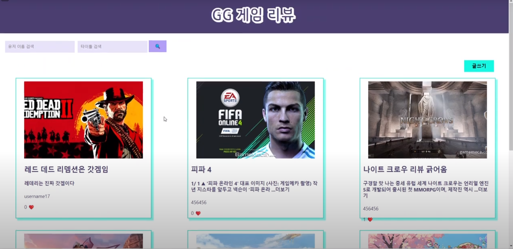
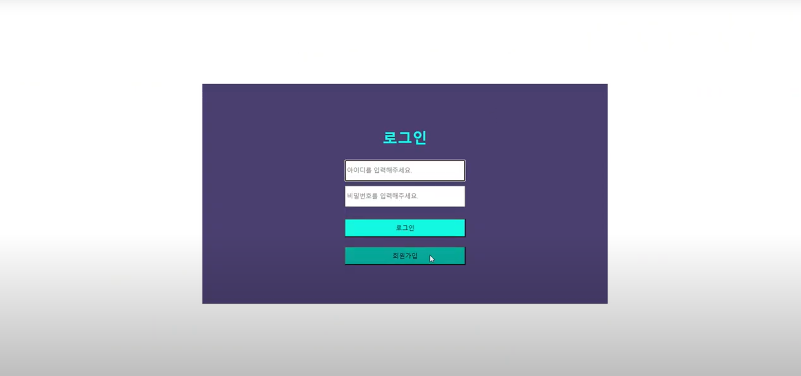
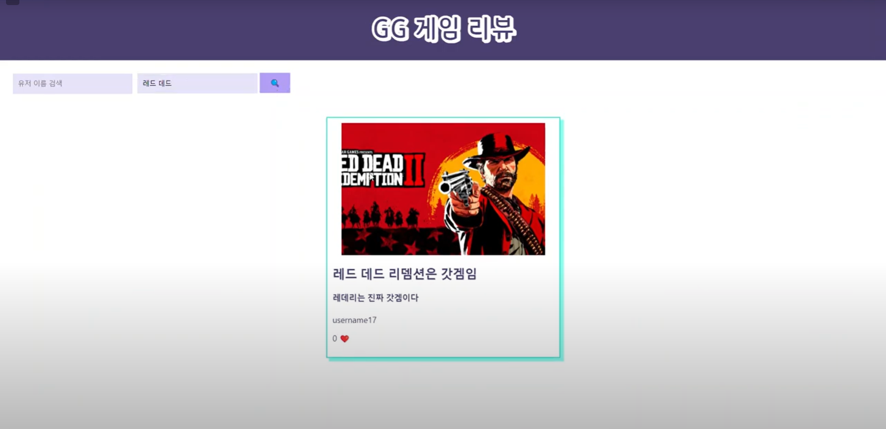
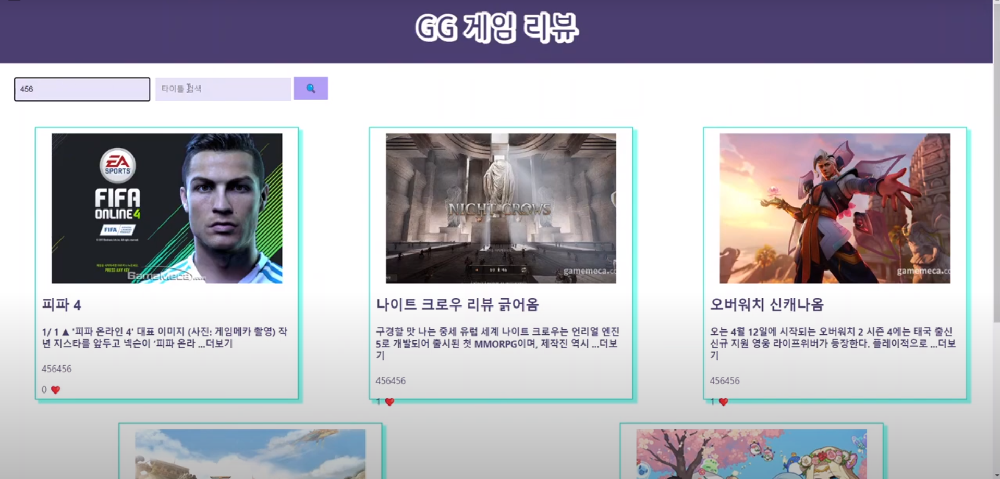
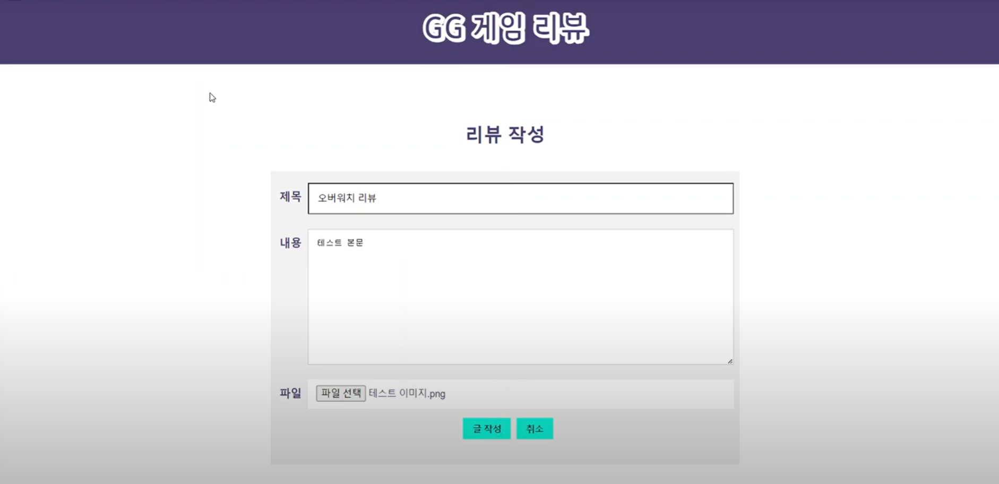
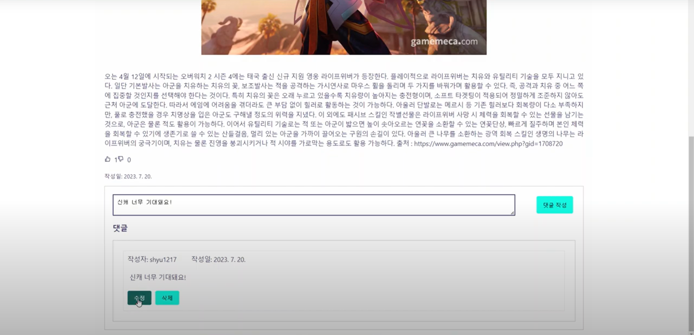

# 게임 소개 및 리뷰 사이트
  

## 목차
[프로젝트 개요](#1-프로젝트-개요)  

[프로젝트 소개](#2-프로젝트-소개)  

[기술스택](#3-기술스택)  

[기술적 의사결정](#4-기술적-의사결정)  

[트러블슈팅 및 고민 점](#5-트러블-슈팅-및-고민-점)  

* * *

### 1 프로젝트 개요

- 팀원 : 유시환, 김광균, 이성목
- 기간 : 2022년 07월 16일 ~ 07월 21일, 5일 간 진행
- 이미지 업로드, 검색이 가능한 게임 소개 및 리뷰 사이트 프로젝트입니다.

* * *  

### 2 프로젝트 소개

<details>
<summary> 담당 역할 </summary>

|역할|담당자|기능|
|:--|:--|:--|
|회원가입, 로그인페이지|유시환,김광균|회원가입, 로그인|
|메인페이지|유시환|게시글 조회|
|검색페이지|유시환|작성내용, 작성자 검색|
|상세페이지|유시환,이성목,김광균|게시글 작성,수정,삭제 댓글 작성,수정,삭제|
|배포|유시환|서버 배포|
</details>

<details>
<summary> 회원가입, 로그인 페이지 </summary>  
    
  
  - 회원가입, 로그인 
</details>

<details>
<summary> 메인페이지 </summary>  
    
  
  - 게시물 조회, 검색    
</details>

<details>
<summary> 검색페이지 </summary>  
     
  
  - 제목 검색  

     
   
   - 작성자 검색    
</details>  

<details>
<summary> 상세페이지 </summary>    
    
  
  - 게시글 작성,수정,삭제  

    
  
  - 댓글 작성,수정,삭제  
</details>  

* * *  

### 3 기술스택

           

* * *  

### 4 기술적 의사결정  

<details>
<summary>   </summary>  
  
  - 팀원들이 모두 사용할 줄 아는 프레임워크였습니다.

  - 익숙한 프레임워크를 사용하는 게 전체적인 프로젝트 진행에 있어서 백엔드 간의 소통이 더 원활할 것이라 판단했습니다.
</details>

<details>
<summary>  </summary>  
      
  - 사용 편의성, 공동작업 용이성 등을 고려했을 때 관계형 데이터베이스가 적합하다고 생각했습니다.

  - 다른 데이터베이스에 비해 어느정도 사용법을 알고 있는 MySQL을 선택하여 빠르고 원활한 프로젝트 진행을 고려했습니다.
</details>  

<details>
<summary>    </summary>  

  - 가상 컴퓨터를 구매하여 FileZilla를 이용하여 쉽게 배포가 가능하고, 사용한 만큼 지불하는 방식이기 때문에 EC2를 선택했습니다.

  - MySQL을 AWS RDS에서 지원하기도 하고, DB 관리를 자동화해주기 때문에 편리성면에서 RDS를 선택했습니다.

  - 이미지 파일을 따로 저장할 수 있는 저장소의 존재가 필요했고, AWS S3 객체 스토리지는 높은 가용성, 성능, 확장성을 가지고 있기 때문에 선택했습니다.
</details>  

<details>
<summary>  </summary>  

  - 검색 서비스를 제공하기 위해서는 쿼리를 작성하고 이를 활용해야한다고 판단했습니다.

  - JPQL은 컴파일 시점에서 에러를 잡을 수 없고, 비즈니스 내 검색 조건이 추가될수록 해당 쿼리의 내용이 복잡해지고 파악하기 어렵다는 단점이 있어 Querydsl을 선택했습니다. 
</details>  

* * * 

### 5 트러블 슈팅 및 고민 점  

<details>
<summary>1. CORS </summary>  
  
  - 프론트엔드와 통신과정에서 CORS 에러가 반복적으로 발생했습니다.
    
  - 해결과정에서 별도의 class 생성 또는 Spring Security의 수동 빈 등록의 방법이 있었는데, 최대한 Spring Security를 활용해보고자 하는 생각에서 후자를 이용해 요청 리소스의 정보를 작성하고 이를 허용하도록 설정했습니다.

  - 그럼에도 CORS가 해결되지 않았는데 이는 preflight 요청 메서드를 명시하지 않았기 때문에 발생하는 에러였고, 이를 위해  OPTIONS 메서드 허용과 exposedHeader를 설정하여 프론트엔드와 원활한 통신이 가능했습니다.
    
```java
@Configuration
@RequiredArgsConstructor
@EnableWebSecurity
public class WebSecurityConfig {

    @Bean
    CorsConfigurationSource corsConfigurationSource() {
        CorsConfiguration config = new CorsConfiguration();

        config.setAllowedOrigins(Arrays.asList("http://localhost:3000"));
        config.setAllowedMethods(Arrays.asList("HEAD","POST","GET","DELETE","PUT","OPTIONS"));
        config.setAllowedHeaders(Arrays.asList("*"));
        config.addExposedHeader("*");
        config.setAllowCredentials(true);

        UrlBasedCorsConfigurationSource source = new UrlBasedCorsConfigurationSource();
        source.registerCorsConfiguration("/**", config);
        return source;
    }
}
```
</details>  

<details>
<summary>2. Response 타입 변경과 정적 메서드 사용 </summary>  
  
  - 기존의 DTO를 사용한 Response는 에러 발생 시, 메세지를 확인하기도 어렵고, 단순 데이터만 있었기에 프론트엔드 측에서 불편함을 이야기했습니다.

  - 따라서 '요청 성공 여부, Dto, 에러 여부 + 에러 메세지' 데이를 프론트엔드에게 제공하고자 했습니다.
    
  - Generic을 이용하여 응답에 담길 성공 여부와 데이터, 에러를 종합하는 ApiResponse<T>를 생성했고, ApiResponse에 실제 값들을 담을 수 있는 ResponseUtil 클래스와 정적 메서드를 작성했습니다.
    
```java
@Getter
@NoArgsConstructor
public class ApiResponse<T>{

    private boolean success;
    private T info;
    private ErrorResponse error;

    public ApiResponse(boolean success, T info, ErrorResponse error) {
        this.success = success;
        this.info = info;
        this.error = error;
    }
}

@Getter
@NoArgsConstructor
public class ResponseUtils {

    public static <T> ApiResponse<T> ok(T response) {
        return new ApiResponse<>(true, response, null);
    }

    public static ApiResponse<?> okWithMessage(SuccessCodeEnum successCodeEnum) {
        return new ApiResponse<>(true, successCodeEnum.getMessage(), null);
    }
    public static ApiResponse<?> error(String message, int status) {
        return new ApiResponse<>(false, null, new ErrorResponse(message, status));
    }

    public static ApiResponse<?> customError(ErrorCodeEnum errorCodeEnum) {
        return new ApiResponse<>(false, null, new ErrorResponse(errorCodeEnum));
    }
}
```

  - 정적 메서드를 이용하였기에, ResponseUtil 클래스의 객체를 직접 생성하지 않아도, 해당 클래스의 메서드를 직접 호출할 수 있고, 입력 값을 기반으로 결과를 반환하는 기능을 가지기 때문에 상태를 유지할 필요가 없게 설정하였습니다. 또한 멤버변수를 설정하지 않았기 때문에 변수가 공유되어 값이 의도치 않게 변경되는 일도 방지했습니다.
  - 메서드의 이름을 통해 그 기능을 명확하게 알 수 있고, 필요하다면 static import를 통해 코드를 보다 간결하게 유지할 수 있다는 점, 인스턴스의 생성이 불필요하므로 객체 관리, 메모리 사용이 줄어들어 사용에 있어 부담이 줄어드는 이점 등을 고려하여 ResponseUtil 클래스의 메서드들을 정적 메서드로 작성했습니다.
</details>  

<details>
<summary>3. 동적 쿼리 </summary>  
  
  - 게시글의 제목과 작성자로 검색할 수 있는 서비스를 계획했습니다. 어떤 값에 null이 들어와도 다른 기준을 바탕으로, 혹은 두 값 모두 null이라면 모든 게시글을 반환하는 로직이 필요했습니다.
    
  - JPQL 이나 네이티브쿼리를 사용할 때에는 복잡한 쿼리일수록 그 내용을 파악하기 어렵고, 휴먼에러의 가능성이 높아지기 때문에, Querydsl을 선택했습니다.

  - 비즈니스적으로 검색 조건의 변경을 염두에 두고 조건의 조합으로 유연성있는 쿼리 작성이 가능한 BooleanExpression 타입을 사용했습니다.
    
```java
@RequiredArgsConstructor
public class PostRepositoryCustomImpl implements PostRepositoryCustom{

    private final JPAQueryFactory query;

    @Override
    public Slice<PostResponseDto> serachPostBySlice(PostSearchCondition condition, Pageable pageable) {
        List<PostResponseDto> result = query
                .select(new QPostResponseDto(
                        post.id,
                        post.title,
                        post.username,
                        post.content,
                        post.createdAt,
                        post.image,
                        post.liked,
                        post.disliked
                ))
                .from(post)
                .where(
                        usernameLike(condition.getUsername()),
                        titleLike(condition.getTitle()))
                .orderBy(post.id.desc())
                .offset(pageable.getOffset())
                .limit(pageable.getPageSize() + 1)
                .fetch();

        return checkEndPage(pageable, result);
    }

    private BooleanExpression usernameLike(String usernameCond) {
        return hasText(usernameCond) ? post.username.like("%" + usernameCond + "%") : null;
    }

    private BooleanExpression titleLike(String titleCond) {
        return hasText(titleCond) ? post.title.like("%" + titleCond + "%") : null;
    }

    private static SliceImpl<PostResponseDto> checkEndPage(Pageable pageable, List<PostResponseDto> content) {
        boolean hasNext = false;
        if (content.size() > pageable.getPageSize()) {
            hasNext = true;
            content.remove(pageable.getPageSize());
        }
        return new SliceImpl<>(content, pageable, hasNext);
    }
}
```

  - 추가적으로 Post 엔티티를 찾은 뒤, 반복문을 사용하여 Dto에 데이터를 담았는데, @QueryProjections를 사용하여 직접 select절에서 해당 값들을 Dto에 담아주는 방식으로 변경했습니다. 서비스의 특성을 고려했을 때, 게시글 조회 상황에서 댓글까지 노출할 필요가 없다고 생각했고, n + 1 문제를 해결하고자 @QueryProjections를 사용했습니다.
</details>  

<details>
<summary>4. 예외처리 </summary>  
  
  - 코드의 일관성과 예외메세지를 일괄적으로 처리할 수 있도록 재구성하고자 했습니다.
    
  - Enum을 통해 해당 예외 메세지들을 한 곳에서 관리하고 IllegalargumentException을 상속받는 InvalidConditionException을 생성하였습니다.

  - 다만 모든 예외를 커스텀하여 처리하는 것보다 해당 예외의 원인이 이미 자바에서 제공하는 예외로 설명이 가능하다면, 이를 활용하는 것이 더 효율적이라는 걸 느낄 수 있었습니다.
    
```java
public class ErrorResponse {

    private String message;
    private int status;

    public ErrorResponse(String message, int status) {
        this.message = message;
        this.status = status;
    }

    public ErrorResponse(ErrorCodeEnum errorCodeEnum) {
        this(errorCodeEnum.getMessage(), errorCodeEnum.getStatus());
    }

    public ErrorResponse(String message, HttpStatus status) {
        this(message, status.value());
    }
}

public enum ErrorCodeEnum {

    TOKEN_INVALID(BAD_REQUEST, "유효한 토큰이 아닙니다."),
    TOKEN_EXPIRED(BAD_REQUEST, "토큰이 만료되었습니다"),
    LOGIN_FAIL(BAD_REQUEST, "로그인 실패"),
    DUPLICATE_USERNAME_EXIST(BAD_REQUEST, "중복된 사용자가 존재합니다"),
    USER_NOT_MATCH(BAD_REQUEST, "작성자만 수정,삭제가 가능합니다"),
    POST_NOT_EXIST(BAD_REQUEST, "존재하지 않는 게시글입니다"),
    COMMENT_NOT_EXIST(BAD_REQUEST, "존재하지 않는 댓글입니다"),
    FILE_INVALID(BAD_REQUEST, "유효한 파일이 아닙니다"),
    FILE_DECODE_FAIL(BAD_REQUEST, "파일 이름 디코딩에 실패했습니다"),
    URL_INVALID(BAD_REQUEST, "잘못된 URL 형식입니다."),
    EXTRACT_INVALID(BAD_REQUEST, "확장자를 추출할 수 없습니다."),
    UPLOAD_FAIL(BAD_REQUEST, "유효하지 않은 요청입니다");

    private final HttpStatus status;
    private final String message;

    ErrorCodeEnum(HttpStatus status, String message) {
        this.status = status;
        this.message = message;
    }
}
```
</details>  

<details>
<summary>5. 이미지 데이터 처리를를 위한 S3와 multipart 사용 </summary>  
  
  - 이미지 URL을 직접 String으로 받아 DB에 저장하려고 했습니다. 하지만 이미지 URL이 너무 긴 경우 DB 저장에서 오류가 발생하고, 만약 해당 URL에서 이미지의 변경,손상이 일어난다면 게시판의 이미지도 변경될 것이라고 판단했습니다. 이러한 점은 사용자에게 큰 불편을 초래할 수 있다고 판단하였기에 파일 자체를 저장할 수 있는 새로운운 방법을 찾아야했습니다.
    
  - 단건 이미지 파일 업로드로 프로젝트를 진행하겠다고 프론트엔드에서 이야기했기 때문에 파일과 JSON을 동시에 받는 방식을 찾게 되었고, @RequestPart를 이용하여 이미지 파일 데이터를 받았습니다.
    
```java
    @PostMapping("/newpost")
    public ApiResponse<?> createPost(@RequestPart(value = "data") PostRequestDto postRequestDto,
                                     @RequestPart(value = "file", required = false) MultipartFile image,
                                     @AuthenticationPrincipal UserDetailsImpl userDetailsImpl) {
        return postService.createPost(postRequestDto, image, userDetailsImpl.getUser());
    }
```

  - 이후, 확장자 추출, 고유 파일명 생성, 객체 키 추출 등을 진행하여 S3에 이미지 파일 저장했습니다. 추가적으로 새롭게 전송된 이미지를 S3에 저장한 후 DB에 저장되어 있는 기존 이미지의 URL에서 객체 키를 추출한 뒤 S3에 해당 객체를 삭제하는 방식으로 수정기능을 구현습니다.
    
```java
@Slf4j
@Service
@RequiredArgsConstructor
public class S3Service {

    private final AmazonS3 amazonS3;
    @Value("${cloud.aws.s3.bucket}")
    private String bucket;
    /**
     * S3에 이미지 업로드 및 이미지 URL 반환
     *
     * @param multipartFile 업로드할 이미지 파일
     * @return 업로드된 이미지의 S3 URL
     * @throws UploadException 업로드 실패 시 발생하는 예외
     */
    public String upload(MultipartFile multipartFile) {
        if (multipartFile == null || multipartFile.isEmpty()) return null;

        try {
            byte[] fileBytes = multipartFile.getBytes();
            String fileName = generateFileName(multipartFile.getOriginalFilename());
            String contentType = multipartFile.getContentType();
            putS3(fileBytes, fileName, contentType);
            return generateUnsignedUrl(fileName);
        } catch (IOException e) {
            throw new UploadException(UPLOAD_FAIL, e);
        }
    }
    /**
     * S3에 이미지를 업로드합니다.
     *
     * @param fileBytes   업로드할 이미지의 바이트 배열
     * @param fileName    업로드할 이미지의 파일 이름
     * @param contentType 업로드할 이미지의 컨텐츠 타입
     */
    private void putS3(byte[] fileBytes, String fileName, String contentType) {
        ObjectMetadata metadata = new ObjectMetadata();
        metadata.setContentLength(fileBytes.length);
        metadata.setContentType(contentType);
        ByteArrayInputStream inputStream = new ByteArrayInputStream(fileBytes);
        amazonS3.putObject(new PutObjectRequest(bucket, fileName, inputStream, metadata));
        log.info("파일 생성: " + fileName);
    }
    /**
     * S3에서 이미지 삭제
     *
     * @param imageUrl 삭제할 이미지의 URL
     * @throws UploadException 이미지 삭제 실패 시 발생하는 예외
     */
    public void delete(String imageUrl) {
        if (StringUtils.hasText(imageUrl)) {
            String fileName = extractObjectKeyFromUrl(imageUrl);
            try {
                String decodedFileName = URLDecoder.decode(fileName, StandardCharsets.UTF_8);
                if (!amazonS3.doesObjectExist(bucket, decodedFileName)) {
                    throw new AmazonS3Exception(decodedFileName + " 은 존재하지 않습니다");
                }
                amazonS3.deleteObject(bucket, decodedFileName);
                log.info("파일 삭제: " + decodedFileName);
            } catch (IllegalArgumentException e) {
                throw new UploadException(FILE_DECODE_FAIL, e);
            }
        }
    }
    /**
     * 이미지 URL에서 S3 객체 키를 추출합니다.
     *
     * @param imageUrl 이미지의 URL
     * @return 추출된 S3 객체 키
     * @throws UploadException 잘못된 URL 형식일 경우 발생하는 예외
     */
    private String extractObjectKeyFromUrl(String imageUrl) {
        try {
            URL url = new URL(imageUrl);
            return url.getPath().substring(1); // Remove the leading slash
        } catch (Exception e) {
            throw new UploadException(URL_INVALID, e);
        }
    }
    /**
     * 업로드할 이미지 파일의 원본 파일 이름으로 고유한 파일 이름을 생성합니다.
     *
     * @param originalFilename 업로드할 이미지 파일의 원본 파일 이름
     * @return 생성된 고유한 파일 이름
     * @throws UploadException 파일 이름이 유효하지 않을 경우 발생하는 예외
     */
    private String generateFileName(String originalFilename) {
        if (StringUtils.hasText(originalFilename)) {
            String extension = extractExtension(originalFilename);
            String uniqueId = UUID.randomUUID().toString();
            return uniqueId + "." + extension;
        }
        throw new UploadException(FILE_INVALID);
    }
    /**
     * 파일 이름에서 확장자를 추출합니다.
     *
     * @param originalFilename 파일 이름
     * @return 추출된 확장자
     * @throws UploadException 확장자를 추출할 수 없을 경우 발생하는 예외
     */
    private String extractExtension(String originalFilename) {
        if (StringUtils.hasText(originalFilename)) {
            int extensionIndex = originalFilename.lastIndexOf(".");
            if (extensionIndex != -1) {
                return originalFilename.substring(extensionIndex + 1);
            }
        }
        throw new UploadException(EXTRACT_INVALID);
    }
    /**
     * S3 객체에 대한 유효기간이 없는 서명되지 않은 URL을 생성합니다.
     *
     * @param objectKey S3 객체 키
     * @return 유효기간이 없는 서명되지 않은 URL
     */
    private String generateUnsignedUrl(String objectKey) {
        String baseUrl = "https://" + bucket + ".s3.amazonaws.com/";
        return baseUrl + objectKey;
    }
}
```
</details>  

<details>
<summary>6. n + 1 문제와 카르테시안 곱 </summary>  
  
  - 실제 쿼리를 날리고 확인하는 과정에서 commentList의 username을 조회하기 위해 user들에 대해서도 쿼리를 날리게 되어 comment를 작성한 user가 5명일 경우 6번의 쿼리가 발생하는 문제가 발생하였습니다.
    
  - 'left join fetch p.commentList cl join fetch cl.user' 쿼리로 기존 문제를 해결할 수 있었지만, 이러한 방식은 실제 row는 10개에 불과한 데이터가 반복적인 join fetch로 인해 row가 부풀려지고 20,30, 혹은 그 이상의 반복되는 row를 가져올 수 있는 카르테시안 곱 문제가 발생할 수 있다고 생각했습니다.

  - 따라서 컬렉션의 요소들을 서브쿼리로 이용하여 가져오는 방법인 @Fetch를 이용하여 post에 대한 쿼리 한 번, comment에 대한 쿼리 한 번(서브쿼리 이용)을 이용해 데이터를 가져올 수 있었습니다. 비록 쿼리 자체의 수는 늘어났지만 과도한 데이터 부풀림 현상을 방지할 수 있기 때문에 기존 해결 방법보다 더 합리적이라고 생각했습니다.
    
```java
    @Fetch(SUBSELECT)
    @OneToMany(mappedBy = "post", cascade = ALL, orphanRemoval = true)
    private List<Comment> commentList = new ArrayList<>();
```
</details>  

<details>
<summary>7. 협업 </summary>  
  
  - 처음 프론트엔드와의 협업은 생각보다 쉽지 않았습니다. 각 분야에 대해서 깊이있는 이해가 있지 않는 이상 빈번하고 생산성있는 의사소통이 프로젝트를 진행하는 데 중요했습니다.
    
  - 또한 분명하고 이해하기 쉬운 API 명세는 꼭 필요하며 명세 작성 과정은 팀원들이 모두 공유하고 참여해야한다는 것도 알 수 있었습니다.

  - 팀장으로서 팀을 이끌어가고 정해지 기한 내에 프로젝트를 완성시키는데 초점을 맞추는 과정은 여러모로 도움이 많이 되는 경험이었습니다. 무엇보다 문제해결방식에 대해서 빠르고 합리적인 방법을 찾는 과정들이 큰 도움이 되었습니다
